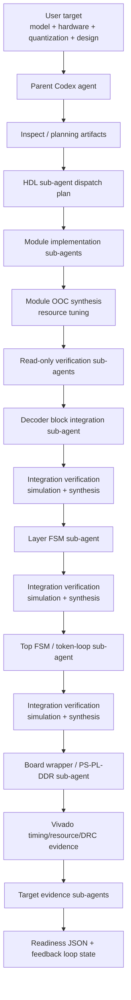

# nl2hdl Framework Overview

This document describes the current nl2hdl coding-agent framework for
generating and verifying Verilog/SystemVerilog accelerator artifacts from a
model target, hardware specification, quantization method, and design style.

The framework is intentionally agent-driven: the parent Codex agent coordinates
contracts, dispatch, evidence, and Skill updates, while HDL sub-agents write or
revise Verilog/SystemVerilog generators and RTL.

Project-owned Codex skill baselines live under `skills/`; see
`docs/project_skills.md`. The active Codex runtime still discovers installed
skills from `~/.codex/skills/`, so repository skill updates should be validated
and then synced into the runtime skill directory when they should affect future
agent runs.

The skill layout is intentionally split by role. `multi-agent-hdl-generation`
is only the router skill. Parent decomposition, HDL module implementation,
module verification, integration, integration verification, and board signoff
each have their own skill under `skills/`. Hardware-specific facts live in
hardware profile skills such as `zcu104-xczu7ev-hardware`, not in the generic
agent-role skills.

## Goal

The long-term target is:

- model: `meta-llama/Llama-3.2-1B`
- board: AMD ZCU104
- FPGA part: `xczu7ev-ffvc1156-2-e`
- quantization: GPTQ-style INT4 weights
- compute style: `simd_vector_mac`
- execution style: `llm_decoder_streaming`
- memory style: `external_ddr_gptq_packed`
- control style: `hierarchical_fsm`
- HDL: SystemVerilog-first

The framework accepts:

- model name or model metadata;
- hardware spec, including FPGA part, target clock, and resource budgets;
- quantization and optimization settings;
- hardware design taxonomy, split into compute, execution, memory, and control
  style;
- free-form optimization and architecture briefs plus candidate directions;
- mode and kernel selection for incremental generation.

## Design Taxonomy

The framework no longer treats `Hardware Design Style` as one overloaded field.
It is split into four axes. These fields are structured input slots, not closed
enums. The names below are useful examples, but a user can provide any
non-empty free-form direction:

- `compute_style`: PE/MAC architecture pattern, such as `simd_vector_mac`,
  `systolic_array`, `tiled_pe_array`, `time_multiplexed_pe`, or `scalar_fsm`.
- `execution_style`: model execution/dataflow strategy, such as
  `layer_by_layer`, `operator_by_operator`, `token_streaming`,
  `llm_decoder_streaming`, `prefill_decode_split`, or `batch_pipeline`.
- `memory_style`: weight, activation, and KV-cache storage/movement strategy,
  such as `external_ddr_gptq_packed`, `external_ddr_streaming`,
  `uram_bram_tiled`, or `onchip_weight_storage`.
- `control_style`: controller structure, such as `hierarchical_fsm`,
  `layer_fsm`, `top_fsm`, or `microcoded_controller`.

Legacy `design.style` remains a compatibility alias. For example,
`llm_decoder_streaming` is an execution/dataflow strategy, not a compute
architecture like `systolic_array` or `simd_vector_mac`.

Common execution styles:

- `layer_by_layer`: run one layer/module at a time with simple sequential
  scheduling; useful for tiny MLPs and first bring-up.
- `operator_by_operator`: generic graph execution where each op is scheduled as
  its own step; useful before model-specific fusion.
- `token_streaming`: stream one token through a pipeline of verified kernels.
- `llm_decoder_streaming`: decoder-only token loop with projection, non-GEMM,
  KV-cache, and external weight streaming.
- `prefill_decode_split`: use different schedules for prompt prefill and
  single-token decode.
- `batch_pipeline`: schedule multiple batch or microbatch items through a
  pipeline when the model/use case allows it.

Use `design.architecture_brief` for natural-language guidance and
`design.design_candidates` for several possible architecture directions. The
parent agent should preserve these fields in dispatch artifacts, compare them
against the model and hardware constraints, and only then assign minimal HDL
module packets.

## Optimization Input

Optimization input follows the same rule: the format is structured, but the
content is open-ended. `optimization.quantization` and `optimization.pruning`
are non-empty strings, not closed enums. Known values such as `int8_static`,
`int4_gptq`, `none`, or `magnitude_unstructured` remain convenient labels, but
the parent agent can also receive descriptions such as mixed precision,
activation-aware scaling, AWQ-style quantization, sparse MLP exploration, or
future compression methods.

Use `optimization.optimization_brief` for natural-language intent,
`optimization.optimization_candidates` for multiple methods to compare, and
`optimization.extra_options` or unknown YAML keys for method-specific metadata.
The parent agent must preserve those fields in planning and sub-agent dispatch
instead of rejecting them solely because they are not in a predefined list.

## Input Clarification Gate

Free-form input is allowed, but the parent agent must not silently guess missing
methodology details. Before HDL sub-agent dispatch, the parent emits
`input_clarification_questions.json`.

If the optimization or hardware design methodology is too ambiguous to assign
module packets, the LLM agent stops with `needs_clarification`. The questions
should be focused on details that change hardware generation, such as:

- quantization bit widths, activation precision, scale/zero-point layout, and
  calibration source;
- pruning or sparsity granularity, sparse metadata layout, and whether zeros
  are static or runtime-skipped;
- compute fabric, execution schedule, memory movement, and control structure;
- verification tolerances, golden reference source, resource budget, and timing
  acceptance criteria.

If no clarification is needed, the report status is `clear` and the parent
continues to model inspection, module packet generation, and sub-agent
dispatch.

## Hardware Resource Schema

Hardware specs separate board/device inventory from the current design budget:

- `device_*` fields describe the FPGA capacity. For ZCU104 /
  `xczu7ev-ffvc1156-2-e`, the example config records
  `device_logic_cells: 504000`, `device_lut: 230400`,
  `device_ff: 460800`, `device_dsp: 1728`, `device_bram_36k: 312`,
  `device_uram: 96`, `device_io: 464`, `device_distributed_ram_mb: 6.2`,
  `device_bram_mb: 11.0`, `device_uram_mb: 27.0`,
  `device_ps_gtr: 4`, and `device_gth: 20`.
- `max_*` fields are the active budget used by planning, tuning, and signoff.
  A full-board target may set `max_*` equal to `device_*`, while individual
  module packets can receive smaller allocated budgets.
- Module OOC synthesis reports and board signoff evidence must record the
  hardware spec they were produced for. A changed device inventory, budget,
  clock, part, or memory width makes old evidence stale.

The main purpose is not for the parent agent to write one large RTL block. The
purpose is to decompose the accelerator into small verified work packets,
delegate those packets to HDL sub-agents, and advance only when each packet has
machine-readable evidence.

## Module Boundary Selection Criteria

The parent agent starts with a large target, then reduces it into the smallest
set of reusable, independently verifiable HDL module types. A boundary is a good
candidate for a separate HDL sub-agent packet when one or more of these criteria
apply:

1. The mathematical operation class is different.
   GEMM/GEMV, RMSNorm, RoPE, softmax/control, residual add, and KV-cache address
   movement have different datapath and control structures.
2. The data movement pattern is different.
   Packed weight streaming, activation buffering, KV-cache read/write, and
   AXI/DDR movement should not be hidden inside an unrelated arithmetic kernel.
3. The expected timing or resource bottleneck is different.
   INT4 projection kernels stress PE lanes, unpack/dequant logic, and memory
   bandwidth; softmax/control stresses approximation and sequencing; KV-cache
   logic stresses address generation and buffering.
4. The unit can be independently verified.
   A sub-agent packet should have a clear input/output contract, Python or NumPy
   golden vectors, and local simulation evidence before it is composed by a
   decoder-block, Layer FSM, or Top FSM agent.
5. The function is reused across model locations.
   Similar projections such as `q_proj`, `k_proj`, `v_proj`, `o_proj`, and MLP
   projections should usually map to a generic projection module type with
   shape, address, and tiling parameters rather than separate hand-written RTL
   implementations.

This means the parent decomposes in this order:

```text
target model and board
-> functional blocks
-> reusable module types
-> minimal sub-agent packets
-> independently verified modules
-> module-level OOC synthesis and tuning
-> decoder-block / Layer FSM / Top FSM integration
-> integration verification synthesis
```

## High-Level Flow



## Agent Roles

### Parent Agent

The parent agent owns:

- model and target decomposition;
- module contracts;
- prompt packets;
- dispatch ordering;
- read-only verification gates;
- feedback packets and retry plans;
- evidence collection;
- ledger reconciliation;
- Skill updates after reusable failures.

The parent agent must not hand-write HDL kernels, Layer FSM RTL, Top FSM RTL, or
board-wrapper RTL. It may edit orchestration, tests, prompts, documentation, and
Skill files when needed.

The parent is the only orchestrator. Every non-parent worker is a Sub-agent and
must return evidence to the parent instead of spawning or retrying other
Sub-agents directly.

Primary skills: `multi-agent-hdl-generation` and
`parent-module-decomposition`.

### HDL Implementation Sub-Agents

HDL sub-agents own focused RTL or generator changes. Each implementation
sub-agent receives:

- one exact module or integration packet;
- a narrow write scope;
- a contract document;
- required commands;
- expected evidence paths;
- forbidden claims.

Each HDL sub-agent must self-verify before reporting success.

Primary skills: `hdl-module-implementation`,
`fpga-vivado-systemverilog`, and `hdl-kernel-contract-gates`.

### Verification Sub-Agents

Verification Sub-agents are read-only by default. They audit:

- requirement coverage;
- simulation evidence;
- Verilator or simulator evidence;
- Vivado timing/resource evidence;
- missing tests;
- unsafe or overbroad claims.

Integration verification Sub-agents are the one evidence-producing exception: they
still must not edit source, RTL, tests, contracts, or child module
implementations, but they may run Vivado for the composed integration top and
write generated synthesis evidence. This integration-level synthesis is
separate from module OOC synthesis. It checks that selected child modules,
integration FSMs, adapters, buffers, and compact status paths still meet timing
and resource constraints when instantiated together.

Primary skills: module verification uses `hdl-module-verification`; integration
verification uses `hdl-integration-verification`,
`fpga-vivado-systemverilog`, and `hdl-vivado-timing-closure`.

### Target Evidence Sub-Agents

Target evidence Sub-agents do not write HDL. They inspect existing artifacts and
write final evidence JSON only when all required proof exists. If proof is
missing, they write a gap report and a `skill_update_candidate`.

## Main Artifacts

Inspect/planning mode emits parent-owned task artifacts such as:

- `hdl_task_manifest.json`
- `hdl_subagent_tasks.json`
- `hdl_subagent_dispatch_plan.json`
- `hdl_subagent_wave_status.json`
- `hdl_subagent_execution_manifest.json`
- `parent_loop_state.json`
- `feedback_packet.json`
- `retry_plan.json`
- `subagent_prompts/*.md`
- `verification_prompts/*.md`
- `target_blocker_remediation_plan.json`
- `target_blocker_remediation_plan.md`

Sub-agents write evidence artifacts such as:

- `kernel_report.json`
- `module_ooc_synthesis_report.json`
- `integration_synthesis_report.json`
- `subagent_result.json`
- simulator logs;
- Vivado timing reports;
- Vivado utilization reports;
- DRC and methodology reports;
- target evidence JSON files.

The parent refreshes global status with:

```bash
python3 -m nl2hdl subagents status \
  --dispatch-plan <hdl_subagent_dispatch_plan.json> \
  --evidence-root <build evidence root> \
  --out <status output directory>
```

The parent records externally spawned Codex agents with:

```bash
python3 -m nl2hdl subagents ledger \
  --execution-manifest <hdl_subagent_execution_manifest.json> \
  --out <ledger output directory> \
  --agent-record <spawn-key>=<agent-id>
```

## HDL Interface Contract

Common module contracts live in
`docs/hdl_module_interface_contract.md`.

The default kernel handshake is:

```systemverilog
input  logic aclk;
input  logic aresetn;
input  logic start_i;
output logic done_o;
```

General rules:

- `aresetn` is synchronous active-low reset.
- `start_i` is sampled while the module is idle.
- `done_o` remains high until `start_i` is deasserted.
- packed vectors use little element order: element `idx` maps to
  `[idx*WIDTH +: WIDTH]`.

## Milestone Structure

The LLaMA/ZCU104 path is split into small gates:

1. Model and semantic graph inspection.
2. GPTQ INT4 metadata and packed-weight layout inspection.
3. INT4 unpack and GPTQ dequant kernels.
4. Projection GEMM/GEMV kernels.
5. Non-GEMM kernels such as RMSNorm, RoPE, residual, and control fixtures.
6. Module-level OOC synthesis and resource tuning for each real datapath
   module.
7. Decoder-block fixture integration.
8. Decoder-block integration verification with simulation and Vivado synthesis.
9. Layer FSM fixture integration.
10. Layer FSM integration verification with simulation and Vivado synthesis.
11. Top FSM and token-loop fixture integration.
12. Top/token-loop integration verification with simulation and Vivado synthesis.
13. DDR/AXI board-shell fixture.
14. Board-shell integration verification with simulation and Vivado synthesis.
15. ZCU104 PS/PL/DDR board-wrapper flow.
16. Target evidence and readiness gates.

Each gate must produce evidence before dependent gates can advance.

## Module-Level Resource Tuning

After a minimal module passes simulation, the parent requires module-level
out-of-context synthesis before integration. This gives the parent a resource
and timing profile for each child module before a decoder-block, Layer FSM, Top
FSM, or board wrapper hides the source of a bottleneck.

For real datapath modules, the OOC report must include:

- Vivado part and target clock;
- setup, hold, pulse-width, DRC, and methodology status;
- LUT, DSP, BRAM, URAM, FF, and I/O use;
- latency or start-to-done cycles;
- throughput estimate for compute kernels;
- selected knobs such as PE lanes, tile sizes, buffer depth, memory word width,
  accumulator width, and pipeline stages;
- resource assessment: `underutilized`, `near_budget`, `bandwidth_limited`,
  `timing_limited`, or `fixture_control_scaffold`.

If a compute module has low utilization and still has timing/resource headroom,
the parent dispatches a tuning retry before integration. If timing fails, the
retry reduces parallelism, adds pipelining, or splits reductions. Integration
agents consume only the selected tuned child configurations and must preserve
the child resource summaries in their integration reports.

## Integration Verification Synthesis

After each integration implementation wave passes its local simulation, the
Integration Verification Agent must run or inspect Vivado synthesis for the
composed integration top. This catches issues that module-level OOC synthesis
cannot see, such as child port fanout, interconnect buffers, FSM/control logic,
status/debug I/O growth, and timing paths across module boundaries.

The integration synthesis report must include:

- the integration top module and child module list;
- Vivado part, target clock, and hardware spec identity;
- selected child tuning knobs consumed from module OOC reports;
- command, log, timing, utilization, DRC, and methodology report paths;
- setup, hold, pulse-width, DRC, and methodology status;
- aggregate LUT, FF, DSP, BRAM, URAM, I/O, and bandwidth-related observations;
- whether the report is fixture-only, bounded integration, or target-scale
  evidence;
- pass/fail status and any retry recommendation.

Child `module_ooc_synthesis_report.json` files are prerequisites, not
substitutes. If integration synthesis fails, the parent routes the failure back
to the responsible integration agent or to a child tuning retry, depending on
whether the failing path is inside integration control/interconnect or inside a
child module boundary.

## Hardware Spec Changes

The hardware spec is part of every synthesis evidence claim. If the FPGA part,
target clock, device resource inventory, resource budgets, memory data width,
or allowed tuning knobs change, previous module OOC reports, integration
reports, and board-level reports are stale unless they explicitly match the new
active spec.

The parent must re-run inspect/dispatch planning and require fresh
module-level synthesis/tuning before allowing decoder-block, Layer FSM, Top FSM,
or board-wrapper integration to consume those modules.

## Failure-to-Skill Loop

When a sub-agent fails and the lesson is reusable, the parent updates a Skill
before retrying. A useful failure record contains:

- failing command;
- observed symptom;
- root-cause hypothesis;
- prevention rule;
- minimal regression check.

This is how the framework avoids repeating the same failure. Examples already
captured include:

- stale pytest node IDs in prompts;
- missing final-response fields in `subagent_result.json`;
- target evidence `task_id` mismatch with the manifest;
- ZCU104 PS PL clock resolving to `5.625 ns / 177.778 MHz` instead of the
  requested `5.000 ns / 200 MHz`.

## Current ZCU104 Board Evidence

The current board-wrapper evidence proves that the generated ZCU104 PS/PL/DDR
wrapper and control-plane path can route at the target clock.

Current raw evidence includes:

- `clk_pl_0`: `5.000 ns / 200.000 MHz`
- setup WNS: `2.193 ns`
- hold WHS: `0.011 ns`
- pulse-width WPWS: `1.000 ns`
- DRC violations: `0`
- methodology violations: `0`
- utilization for this wrapper build: LUT `449`, DSP `0`, BRAM `0`

Important distinction: these resource numbers are for the current board-wrapper
and control-plane scaffold, not for a full LLaMA INT4 compute datapath.

The current routed child accelerator is a small placeholder/control stub. It is
not the full INT4 projection engine, decoder block, Layer FSM, Top FSM, KV-cache
movement engine, or full LLaMA accelerator.

## What Is Complete

The framework currently has:

- parent/sub-agent orchestration;
- module contract structure;
- dispatch manifests and prompt generation;
- wave status and evidence collection;
- spawn ledger reconciliation;
- failure-to-Skill retry discipline;
- multiple kernel and integration fixture contracts;
- full-model execution readiness evidence for the bounded framework path;
- ZCU104 PS/PL/DDR board-wrapper evidence at 200 MHz.

## What Is Not Yet Claimed

The current framework does not claim:

- full target-scale LLaMA-3.2-1B numeric accelerator implementation;
- real GPTQ checkpoint tensor materialization for every weight tensor;
- hardware lab runtime validation;
- bitstream programming success;
- XSA export success;
- real-time LLaMA inference performance;
- final resource use of the real INT4 compute datapath.

The `449 LUT / 0 DSP / 0 BRAM` report must not be interpreted as the resource
cost of the final LLaMA accelerator.

## Next Engineering Step

The next major step is to replace the placeholder `zcu104_accelerator_core`
inside the ZCU104 board wrapper with the generated accelerator top from the
verified integration chain.

That should be delegated to sub-agents in this order:

1. Confirm the accelerator-top interface contract.
2. Connect the verified Top FSM or model FSM child to the board wrapper.
3. Preserve PS AXI control, reset, status, and compact board IO.
4. Re-run simulation and Vivado route.
5. Produce a new resource/timing evidence file that clearly distinguishes:
   - board wrapper/control-plane resources;
   - actual LLaMA accelerator datapath resources;
   - remaining fixture-only limitations.

Only after that step will LUT/DSP/BRAM numbers meaningfully describe the real
accelerator design rather than the board wrapper scaffold.
